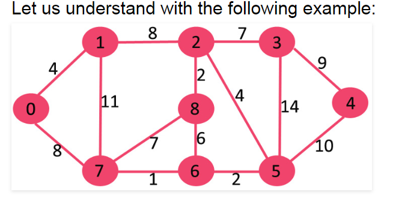
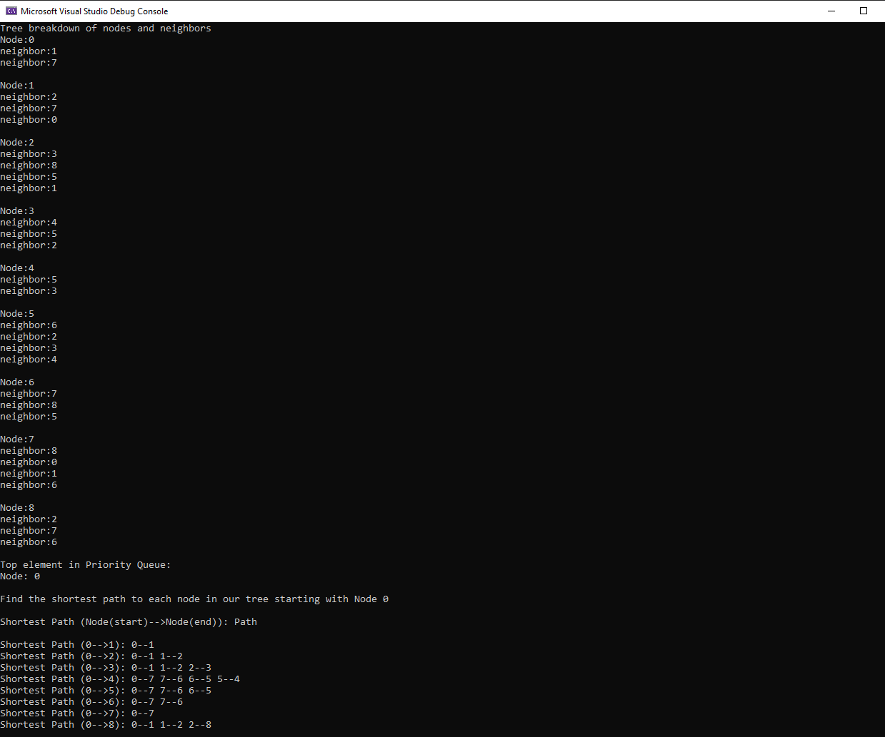

This project implements Dijkstras algorithm using a test data set that is formed into a graph of nodes with with weighted edges connecting them. The application builds the tree, calculates the shortes path to each node in the tree starting from node 0, and prints the results.

[Dijkstras Algorithm](https://en.wikipedia.org/wiki/Dijkstra's_algorithm)
# Graph

# Shortest Path Calcuation

